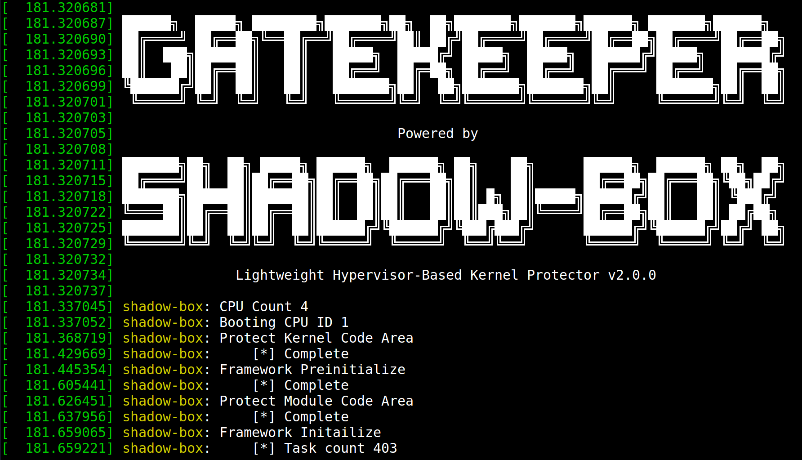

```bash      
 ██████╗  █████╗ ████████╗███████╗██╗  ██╗███████╗███████╗██████╗ ███████╗██████╗ 
 ██╔════╝ ██╔══██╗╚══██╔══╝██╔════╝██║ ██╔╝██╔════╝██╔════╝██╔══██╗██╔════╝██╔══██╗
 ██║  ███╗███████║   ██║   █████╗  █████╔╝ █████╗  █████╗  ██████╔╝█████╗  ██████╔╝
 ██║   ██║██╔══██║   ██║   ██╔══╝  ██╔═██╗ ██╔══╝  ██╔══╝  ██╔═══╝ ██╔══╝  ██╔══██╗
 ╚██████╔╝██║  ██║   ██║   ███████╗██║  ██╗███████╗███████╗██║     ███████╗██║  ██║
  ╚═════╝ ╚═╝  ╚═╝   ╚═╝   ╚══════╝╚═╝  ╚═╝╚══════╝╚══════╝╚═╝     ╚══════╝╚═╝  ╚═╝
                                  Powered by
	
 ███████╗██╗  ██╗ █████╗ ██████╗  ██████╗ ██╗    ██╗      ██████╗  ██████╗ ██╗  ██╗
 ██╔════╝██║  ██║██╔══██╗██╔══██╗██╔═══██╗██║    ██║      ██╔══██╗██╔═══██╗╚██╗██╔╝
 ███████╗███████║███████║██║  ██║██║   ██║██║ █╗ ██║█████╗██████╔╝██║   ██║ ╚███╔╝ 
 ╚════██║██╔══██║██╔══██║██║  ██║██║   ██║██║███╗██║╚════╝██╔══██╗██║   ██║ ██╔██╗ 
 ███████║██║  ██║██║  ██║██████╔╝╚██████╔╝╚███╔███╔╝      ██████╔╝╚██████╔╝██╔╝ ██╗
 ╚══════╝╚═╝  ╚═╝╚═╝  ╚═╝╚═════╝  ╚═════╝  ╚══╝╚══╝       ╚═════╝  ╚═════╝ ╚═╝  ╚═╝
      
                Lightweight Hypervisor-Based Kernel Protector
```

# 1. Notice
Gatekeeper is based on Shadow-box v1 (for x86), and it is a sub-project of Shadow-box.

Shadow-box v2 (for ARM) is a next generation of Shadow-box v1 (for x86). If you want to know about Shadow-box for ARM, please visit [Shadow-box for ARM project](https://github.com/kkamagui/shadow-box-for-arm).

Major changes are as followed:
 - Change rootkit detection/protection features to abnormal privilege escalation detection/protection features
 - Page Table Isolation (PTI) support
 - Sleep mode of Intel Integrated Graphics support

# 1.1. Presentations and Papers
Gatekeeper and Shadow-box is a lightweight and practical kernel protector, and it was introduced at security conferences below.
 - Gatekeeper: [beVX 2018](https://www.beyondsecurity.com/bevxcon/speakers.html#SeunghunHan)
 - [Black Hat Asia 2018](https://www.blackhat.com/asia-18/briefings.html#shadow-box-v2-the-practical-and-omnipotent-sandbox-for-arm)
 - [Black Hat Asia 2017](https://www.blackhat.com/asia-17/briefings.html#myth-and-truth-about-hypervisor-based-kernel-protector-the-reason-why-you-need-shadow-box) and [Black Hat Asia Arsenal 2017](https://www.blackhat.com/asia-17/arsenal.html#shadow-box-lightweight-hypervisor-based-kernel-protector)
 - [HITBSecConf 2017](http://conference.hitb.org/hitbsecconf2017ams/sessions/shadowbox-the-practical-and-omnipotent-sandbox/)

You can watch the demo videos below.
 - [Gatekeeper Demo](https://youtu.be/gjpxeKlzA9s): It shows that Gatekeeper can detect and prevent local privilege escalation exploits.
 - [Shadow-box Demo 1](https://youtu.be/3_cFDVHWCXA): It shows that rootkits can neutralize kernel protection mechanism. 
 - [Shadow-box Demo 2](https://youtu.be/s7iZYg4vP4E): It shows that Shadow-box can prevent kernel from rootkits.

[](https://www.youtube.com/watch?v=gjpxeKlzA9s)

(Gatekeeper Demo)

[](https://www.youtube.com/watch?v=3_cFDVHWCXA)

(Shadow-box Demo 1)

[](https://www.youtube.com/watch?v=s7iZYg4vP4E)

(Shadow-box Demo 2)

# 1.2. Contributions
We always welcome your contributions. Issue report, bug fix, new feature implementation, anything is alright. Feel free to send us. 

# 1.3. License
Gatekeeper and Shadow-box has GPL v2 license. 

# 2. Introduction of Gatekeeper and Shadow-Box
Gatekeeper is a prototype for preventing and detecting local privilege escalation (LPE) exploits. It is based on Shadow-box.

Shadow-box is a security monitoring framework for operating systems using state-of-the-art virtualization technologies. 
Shadow-box has a novel architecture inspired by a shadow play. We made Shadow-box from scratch, and it is primarily composed of a lightweight hypervisor and a security monitor. 

The lightweight hypervisor, Light-box, efficiently isolates an OS inside a guest machine and projects static and dynamic kernel objects of the guest into the host machine so that our security monitor in the host can investigate the projected images. 
The security monitor, Shadow-Watcher, places event monitors on static kernel elements and tests security of dynamic kernel elements. 

Shadow-box manipulates address translations from the guest physical address to the host physical address in order to exclude unauthorized accesses to the host and the hypervisor spaces. In that way, Shadow-box can properly introspect the guest operating system and mediate all accesses, even when the operating system is compromised.

# 2.1. Architecture of Gatekeeper and Shadow-Box
Gatekeeper is based on Shadow-box, and Shadow-box is a lightweight and practical security monitoring framework using virtualization technologies.

If you want to know more about Gatekeeper, please see my presentation at [beVX 2018](https://www.beyondsecurity.com/bevxcon/speakers.html#SeunghunHan).

<center>  </center>

We developed a security monitoring framework, Shadow-box that keeps an OS safe by filtering out unauthorized accesses to important kernel elements and defending the integrity of kernel elements periodically. Shadow-box relies upon its two subparts: a lightweight hypervisor and a security monitor. The lightweight hypervisor, Light-box, efficiently isolates an OS inside a guest machine and projects static and dynamic kernel objects of the guest into the host machine, so that our security monitor in the host can investigate the projected images. The security monitor, Shadow-watcher, places event monitors on static kernel elements and tests security of dynamic kernel elements. Running inside the host, it can test the security of the guest without malicious interference even when the guest OS is compromised.

If you want to know more about Shadow-box, please see my presentation and paper at [Black Hat Asia 2017](https://www.blackhat.com/asia-17/briefings.html#myth-and-truth-about-hypervisor-based-kernel-protector-the-reason-why-you-need-shadow-box) and [HITBSecConf 2017](http://conference.hitb.org/hitbsecconf2017ams/sessions/shadowbox-the-practical-and-omnipotent-sandbox/).


# 3. How to Build 
# 3.1. Prepare Kernel Build Environment (Ubuntu 16.04)
Because the Shadow-box protects the code area of the kernel, it conflicts with the runtime kernel patch feature (CONFIG_JUMP_LABEL). Therefore, if your kernel uses the runtime kernel patch feature, you should remove the feature. To remove it, you need to set a kernel build environment, change the kernel options, and install. The process is as follows.

```bash
# Prepare kernel source and build environment.
$> apt-get source linux
$> sudo apt-get build-dep linux
$> sudo apt-get install ncurses-dev

# Make new .config file.
$> cd linux-<your_kernel_version>
$> cp /boot/config-<your_kernel_version> .config
$> make menuconfig
# Load the .config file using the "Load" menu and save it to .config using the "Save" menu.

$> sed -i 's/CONFIG_JUMP_LABEL=y/# CONFIG_JUMP_LABEL is not set/g' .config

# Build kernel and modules.
$> make -j8; make modules

# Install kernel and modules.
$> sudo make modules_install
$> sudo make install
``` 

# 3.2. Prepare Gatekeeper and Kernel Symbols
Gatekeeper should locate the data structures and functions for kernel integrity verification. These symbols can be found using kallsyms, but all symbols are not exposed to kallsyms. Therefore, Gatekeeper uses the System.map file to embed symbols and kernel versions.
How to add symbols and kernel versions to Gatekeeper is as follows:

```bash
# Prepare Gatekeeper source.
$> git clone -b gatekeeper https://github.com/kkamagui/shadow-box-for-x86.git
$> cd shadow-box-for-x86

# Prepare kernel symbols.
$> uname -v
#37-Ubuntu SMP Mon Apr 18 18:33:37 UTC 2016			<== Kernel version

# Copy system.map file to kernel_version name.
$> cp /boot/System.map-<your_kernel_version> system.map/"#37-Ubuntu SMP Mon Apr 18 18:33:37 UTC 2016.map"
```

# 3.3. Build Gatekeeper
When the kernel symbol is ready, type "make" command to build the Gatekeeper. Then you can find gatekeeper.ko in the same directory.
```bash
$> make
$> ls
gatekeeper.ko shadow_box.h ...

```

# 4. How to Use
Gatekeeper is loadable kernel module (LKM). So, when you need protection, you can load the gatekeeper.ko module into the kernel with the insmod command. If you know more about examples below, please watch the demo video, [Gatekeeper Demo](https://www.youtube.com/watch?v=gjpxeKlzA9s).

```bash
$> sudo insmod gatekeeper.ko
```
<center>  </center>

After Gatekeeper is loaded, you can test the protection mechanisms of Gatekeeper using local privilege escalation (LPE) exploits such as [Linux Kernel Exploits](https://github.com/kkamagui/linux-kernel-exploits). 
Here is the example of LPE detection and prevention. If Gatekeeper detects and prevents LPE exploits, Gatekeeper writes kernel log messages about them.

```bash
# Download LPE exploits from GitHub.
$> git clone https://github.com/kkamagui/linux-kernel-exploits.git
Cloning into 'linux-kernel-exploits'...
... omitted ...
Checking connectivity... done.

# Build the LPE exploit 1 (CVE-2017-16995 with kernel version 4.10.0-28-generic).
$> cd linux-kernel-exploits/kernel-4.10.0-28-generic/CVE-2017-16995
$> ./compile.sh

# Execute the LPE exploit and it fails to get a root shell.
$> ./CVE-2017-16995
[.]
[.] t(-_-t) exploit for counterfeit grsec kernels such as KSPP and linux-hardened t(-_-t)
[.]
[.]   ** This vulnerability cannot be exploited at all on authentic grsecurity kernel **
[.]
[*] creating bpf map
[*] sneaking evil bpf past the verifier
[*] creating socketpair()
[*] attaching bpf backdoor to socket
[*] skbuff => ffff88004aa80100
[*] Leaking sock struct from ffff880050b94b40
[*] Sock->sk_rcvtimeo at offset 472
[*] Cred structure at ffff8800d191cd80
[*] UID from cred structure: 1000, matches the current: 1000
[*] hammering cred structure at ffff8800d191cd80
!!!!! Fail !!!!!

# Build the LPE exploit 2 (CVE-2016-5195 with kernel version 4.4.0-31-generic).
$> cd linux-kernel-exploirt/linux-4.4.0-31-generic/CVE-2016-5195
$> ./compile.sh

# Execute the LPE exploit and it succeeds to get a root shell. But, Gatekeeper still can detect it.
$> ./CVE-2016-5195
[*] let make some c0ws dirty
[+] ok we have some dirty things going on
!!!!! Success !!!!!

# Show kernel log messages.
$> dmesg
... omitted ...
[ 8655.747920]      
[ 8655.747921] ██████╗  █████╗ ████████╗███████╗██╗  ██╗███████╗███████╗██████╗ ███████╗██████╗ 
[ 8655.747922] ██╔════╝ ██╔══██╗╚══██╔══╝██╔════╝██║ ██╔╝██╔════╝██╔════╝██╔══██╗██╔════╝██╔══██╗ 
[ 8655.747923] ██║  ███╗███████║   ██║   █████╗  █████╔╝ █████╗  █████╗  ██████╔╝█████╗  ██████╔╝ 
[ 8655.747924] ██║   ██║██╔══██║   ██║   ██╔══╝  ██╔═██╗ ██╔══╝  ██╔══╝  ██╔═══╝ ██╔══╝  ██╔══██╗ 
[ 8655.747924] ╚██████╔╝██║  ██║   ██║   ███████╗██║  ██╗███████╗███████╗██║     ███████╗██║  ██║ 
[ 8655.747925]  ╚═════╝ ╚═╝  ╚═╝   ╚═╝   ╚══════╝╚═╝  ╚═╝╚══════╝╚══════╝╚═╝     ╚══════╝╚═╝  ╚═╝ 
[ 8655.747925]      
[ 8655.747926]                                   Powered by
[ 8655.747926]      
[ 8655.747927] ███████╗██╗  ██╗ █████╗ ██████╗  ██████╗ ██╗    ██╗      ██████╗  ██████╗ ██╗  ██╗
[ 8655.747927] ██╔════╝██║  ██║██╔══██╗██╔══██╗██╔═══██╗██║    ██║      ██╔══██╗██╔═══██╗╚██╗██╔╝
[ 8655.747928] ███████╗███████║███████║██║  ██║██║   ██║██║ █╗ ██║█████╗██████╔╝██║   ██║ ╚███╔╝ 
[ 8655.747929] ╚════██║██╔══██║██╔══██║██║  ██║██║   ██║██║███╗██║╚════╝██╔══██╗██║   ██║ ██╔██╗ 
[ 8655.747929] ███████║██║  ██║██║  ██║██████╔╝╚██████╔╝╚███╔███╔╝      ██████╔╝╚██████╔╝██╔╝ ██╗
[ 8655.747930] ╚══════╝╚═╝  ╚═╝╚═╝  ╚═╝╚═════╝  ╚═════╝  ╚══╝╚══╝       ╚═════╝  ╚═════╝ ╚═╝  ╚═╝
[ 8655.747930]      
[ 8655.747931]               Lightweight Hypervisor-Based Kernel Protector v2.0.0
[ 8655.747931]      
[ 8655.758747] shadow-box: CPU Count 4
[ 8655.758748] shadow-box: Booting CPU ID 2
[ 8655.772943] shadow-box: Protect Kernel Code Area
[ 8655.801492] shadow-box:     [*] Complete
[ 8655.809401] shadow-box: Framework Preinitialize
[ 8655.957163] shadow-box:     [*] Complete
[ 8655.978407] shadow-box: Protect Module Code Area
[ 8655.989540] shadow-box:     [*] Complete
[ 8656.011088] shadow-box: Framework Initailize
[ 8656.011254] shadow-box:     [*] Task count 413
[ 8656.011255] shadow-box:     [*] Module count 119
[ 8656.011255] shadow-box:     [*] Complete
[ 8656.022170] shadow-box: Lock IOMMU
[ 8656.031913] shadow-box:     [*] Intel Integrated Graphics is detected
[ 8656.032224] shadow-box:     [*] Lock IOMMU complete
[ 8656.073063] shadow-box: Execution Complete
[ 8656.073065] shadow-box: errorcode=0


# CVE-2017-16995 is prevented
[ 8671.122817] shadow-box: VM [0] [CVE-2017-16995][PID 5570] cred is changed abnormally org[UID 1000, GID 1000, SUID 1000, SGID 1000, EUID 1000, EGID 1000, FSUID 1000, FSGID 1000], new[UID 0, GID 1000, SUID 1000, SGID 1000, EUID 1000, EGID 1000, FSUID 1000, FSGID 1000], Terminate it.
[ 8671.122871] shadow-box: VM [0] An abnormal privilege escalation is detected. [CVE-2017-16995][PID 5570, TGID 5570] is killed

... omitted ...

# CVE-2016-5195 is detected
[ 8712.268594] shadow-box: VM [0] [passwd][PID 3186, TGID 3186] cred is changed, old[UID 1000], new[UID 0, GID 1000, EUID 0, EGID 0, FSUID 0, FSGID 0]
[ 8712.268864] shadow-box: VM [1] [sh][PID 3186, TGID 3186] is executed and has privilege, new[UID 0, GID 1000, EUID 0, EGID 0, FSUID 0, FSGID 0]
[ 8712.439077] shadow-box: VM [0] [sh][PID 3186, TGID 3186] creates privileged task [sh][PID 3187, TGID 3187, UID 0]
[ 8712.439629] shadow-box: VM [1] [id][PID 3187, TGID 3187] is executed and has privilege, new[UID 0, GID 1000, EUID 0, EGID 1000, FSUID 0, FSGID 1000]

```

# 5.Caution
Shadow-box protects kernel code, read-only data, system table, privilege register, etc. from rootkits. So, if you want to use Shadow-box, you should disable some features below.
 * Disable CONFIG_JUMP_LABEL
   * Change kernel config (.config)
 * Disable hibernation and suspend
   * Change system power management setting
 * Disable IRQ remapping for using IOMMU protection feature
   * Insert intremap=off at the end of linux /boot/vmlinuz... line in grub.cfg file

# 6.Known Issue
Gatekeeper and Shadow-box have some known issues below.
 * Too many logs in secure world stops the system intermittently.
   * If you want to log massive information, make FIFO like a kfifo and connect normal world and secure world

# Acknowledgments
Shadow-box has been used to protect the kernel of Gooroom platform which is an open source project. This work was supported by Institute for Information & communications Technology Promotion (IITP) grant funded by the Korea government (MSIP) (No.R0236-15-1006, Open Source Software Promotion).  

