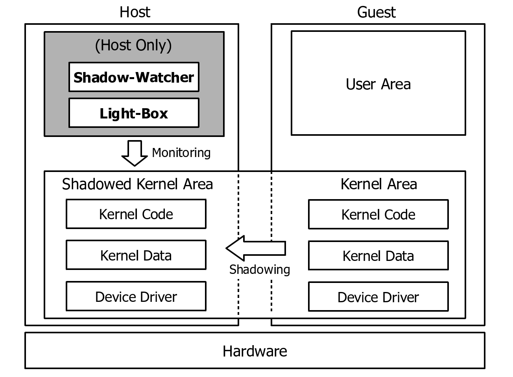
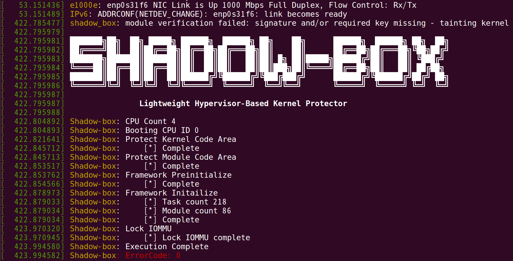

```bash      
 ███████╗██╗  ██╗ █████╗ ██████╗  ██████╗ ██╗    ██╗      ██████╗  ██████╗ ██╗  ██╗
 ██╔════╝██║  ██║██╔══██╗██╔══██╗██╔═══██╗██║    ██║      ██╔══██╗██╔═══██╗╚██╗██╔╝
 ███████╗███████║███████║██║  ██║██║   ██║██║ █╗ ██║█████╗██████╔╝██║   ██║ ╚███╔╝ 
 ╚════██║██╔══██║██╔══██║██║  ██║██║   ██║██║███╗██║╚════╝██╔══██╗██║   ██║ ██╔██╗ 
 ███████║██║  ██║██║  ██║██████╔╝╚██████╔╝╚███╔███╔╝      ██████╔╝╚██████╔╝██╔╝ ██╗
 ╚══════╝╚═╝  ╚═╝╚═╝  ╚═╝╚═════╝  ╚═════╝  ╚══╝╚══╝       ╚═════╝  ╚═════╝ ╚═╝  ╚═╝
      
                Lightweight Hypervisor-Based Kernel Protector
```

# 1. Notice
Shadow-box v2 (for ARM) is a next generation of Shadow-box v1 (for x86). If you want to know about Shadow-box for ARM, please visit [Shadow-box for ARM project](https://github.com/kkamagui/shadow-box-for-arm).

Major changes are as followed:
 - Page Table Isolation (PTI) support

# 1.1. Presentations and Papers
Shadow-box is a lightweight and practical kernel protector, and it was introduced at security conferences below.
 - [Black Hat Asia 2017](https://www.blackhat.com/asia-17/briefings.html#myth-and-truth-about-hypervisor-based-kernel-protector-the-reason-why-you-need-shadow-box) and [Black Hat Asia Arsenal 2017](https://www.blackhat.com/asia-17/arsenal.html#shadow-box-lightweight-hypervisor-based-kernel-protector)
 - [HITBSecConf 2017](http://conference.hitb.org/hitbsecconf2017ams/sessions/shadowbox-the-practical-and-omnipotent-sandbox/)

You can watch the demo videos below.
 - [Demo 1](https://youtu.be/3_cFDVHWCXA): It shows that if you use only kernel-level protection mechanism such as page write-protect, rootkits can neutralize it. 
 - [Demo 2](https://youtu.be/s7iZYg4vP4E): It shows that if you use kernel-level protection mechanism with Shadow-box, then rootkits cannot neutralize it and cannot work. 

[](https://www.youtube.com/watch?v=3_cFDVHWCXA)
[](https://www.youtube.com/watch?v=s7iZYg4vP4E)

# 1.2. Contributions
We always welcome your contributions. Issue report, bug fix, new feature implementation, anything is alright. Feel free to send us. 

# 1.3. License
Shadow-box has the dual license, GPL v2 and MIT. You can choose any license you want.

# 2. Introduction of Shadow-Box
Shadow-box is a security monitoring framework for operating systems using state-of-the-art virtualization technologies. 
Shadow-box has a novel architecture inspired by a shadow play. We made Shadow-box from scratch, and it is primarily composed of a lightweight hypervisor and a security monitor. 

The lightweight hypervisor, Light-box, efficiently isolates an OS inside a guest machine and projects static and dynamic kernel objects of the guest into the host machine so that our security monitor in the host can investigate the projected images. 
The security monitor, Shadow-Watcher, places event monitors on static kernel elements and tests security of dynamic kernel elements. 

Shadow-box manipulates address translations from the guest physical address to the host physical address in order to exclude unauthorized accesses to the host and the hypervisor spaces. In that way, Shadow-box can properly introspect the guest operating system and mediate all accesses, even when the operating system is compromised.

# 2.1. Architecture of Shadow-Box
We explain how we designed the Light-box and the Shadow-watcher. It is designed to support a lightweight and practical security monitoring framework using virtualization technologies.

<center>  </center>

We developed a security monitoring framework, Shadow-box that keeps an OS safe by filtering out unauthorized accesses to important kernel elements and defending the integrity of kernel elements periodically. Shadow-box relies upon its two subparts: a lightweight hypervisor and a security monitor. The lightweight hypervisor, Light-box, efficiently isolates an OS inside a guest machine and projects static and dynamic kernel objects of the guest into the host machine, so that our security monitor in the host can investigate the projected images. The security monitor, Shadow-watcher, places event monitors on static kernel elements and tests security of dynamic kernel elements. Running inside the host, it can test the security of the guest without malicious interference even when the guest OS is compromised.

If you want to know more about Shadow-box, please see my presentation and paper at [Black Hat Asia 2017](https://www.blackhat.com/asia-17/briefings.html#myth-and-truth-about-hypervisor-based-kernel-protector-the-reason-why-you-need-shadow-box) and [HITBSecConf 2017](http://conference.hitb.org/hitbsecconf2017ams/sessions/shadowbox-the-practical-and-omnipotent-sandbox/).


# 3. How to Build 
# 3.1. Prepare Kernel Build Environment (Ubuntu 16.04)
Because the Shadow-box protects the code area of the kernel, it conflicts with the runtime kernel patch feature (CONFIG_JUMP_LABEL). Therefore, if your kernel uses the runtime kernel patch feature, you should remove the feature. To remove it, you need to set a kernel build environment, change the kernel options, and install. The process is as follows.

```bash
# Prepare kernel source and build environment.
$> apt-get source linux
$> sudo apt-get build-dep linux
$> sudo apt-get install ncurses-dev

# Make new .config file.
$> cd linux-<your_kernel_version>
$> cp /boot/config-<your_kernel_version> .config
$> make menuconfig
# Load the .config file using the "Load" menu and save it to .config using the "Save" menu.

$> sed -i 's/CONFIG_JUMP_LABEL=y/# CONFIG_JUMP_LABEL is not set/g' .config

# Build kernel and modules.
$> make -j8; make modules

# Install kernel and modules.
$> sudo make modules_install
$> sudo make install
``` 

# 3.2. Prepare Shadow-Box and Kernel Symbols
Shadow-box should locate the data structures and functions for kernel integrity verification. These symbols can be found using kallsyms, but all symbols are not exposed to kallsyms. Therefore, Shadow-box uses the System.map file to embed symbols and kernel versions.
How to add symbols and kernel versions to Shadow-box is as follows:

```bash
# Prepare Shadow-box source.
$> git clone https://github.com/kkamagui/shadow-box-for-x86.git
$> cd shadow-box-for-x86

# Prepare kernel symbols.
$> uname -v
#37-Ubuntu SMP Mon Apr 18 18:33:37 UTC 2016			<== Kernel version

# Copy system.map file to kernel_version name.
$> cp /boot/System.map-<your_kernel_version> system.map/"#37-Ubuntu SMP Mon Apr 18 18:33:37 UTC 2016.map"
```

# 3.3. Build Shadow-Box
When the kernel symbol is ready, type "make" command to build the Shadow-box. Then you can find shadow_box.ko in the same directory.
```bash
$> make
$> ls
shadow_box.ko shadow_box.h ...

```

# 4. How to Use
Shadow-box is loadable kernel module (LKM). So, when you need protection, you can load the shadow-box.ko module into the kernel with the insmod command.
```bash
$> sudo insmod shadow-box.ko
```
<center>  </center>

After Shadow-box is loaded, you can test the protection mechanisms of Shadow-box using rootkits such as [Adore-ng](https://github.com/kkamagui/adore-ng). If you want to watch demo videos, please follow these links, [Demo 1](https://youtu.be/3_cFDVHWCXA) and [Demo 2](https://youtu.be/s7iZYg4vP4E).

Here is the rootkit detection example. If Shadow-box detects rootkits, Shadow-box writes kernel log messages about rootkit attacks.

```bash
# Load Adore-ng rootkit by command-line.
$> insmod adore_ng.ko
Segmentation fault (codre dumped)

# Show kernel log messages.
$> dmesg
... omitted ...
[    4.182249] Bluetooth: BNEP filters: protocol multicast
[    4.182252] Bluetooth: BNEP socket layer initialized
[   43.615020] shadow_box: module verification failed: signature and/or required key missing - tainting kernel
[   43.625298]      
[   43.625299] ███████╗██╗  ██╗ █████╗ ██████╗  ██████╗ ██╗    ██╗      ██████╗  ██████╗ ██╗  ██╗
[   43.625300] ██╔════╝██║  ██║██╔══██╗██╔══██╗██╔═══██╗██║    ██║      ██╔══██╗██╔═══██╗╚██╗██╔╝
[   43.625301] ███████╗███████║███████║██║  ██║██║   ██║██║ █╗ ██║█████╗██████╔╝██║   ██║ ╚███╔╝ 
[   43.625302] ╚════██║██╔══██║██╔══██║██║  ██║██║   ██║██║███╗██║╚════╝██╔══██╗██║   ██║ ██╔██╗ 
[   43.625303] ███████║██║  ██║██║  ██║██████╔╝╚██████╔╝╚███╔███╔╝      ██████╔╝╚██████╔╝██╔╝ ██╗
[   43.625303] ╚══════╝╚═╝  ╚═╝╚═╝  ╚═╝╚═════╝  ╚═════╝  ╚══╝╚══╝       ╚═════╝  ╚═════╝ ╚═╝  ╚═╝
[   43.625304]      
[   43.625304]                Lightweight Hypervisor-Based Kernel Protector
[   43.625305]      
[   43.633127] Shadow-box: CPU Count 4
[   43.633128] Shadow-box: Booting CPU ID 0
[   43.648616] Shadow-box: Protect Kernel Code Area
[   43.670134] Shadow-box:     [*] Complete
[   43.670135] Shadow-box: Protect Module Code Area
[   43.677168] Shadow-box:     [*] Complete
[   43.677338] Shadow-box: Framework Preinitialize
[   43.678077] Shadow-box:     [*] Complete
[   43.702142] Shadow-box: Framework Initailize
[   43.702180] Shadow-box:     [*] Task count 225
[   43.702181] Shadow-box:     [*] Module count 86
[   43.702182] Shadow-box:     [*] Complete
[   44.793463] Shadow-box: Lock IOMMU
[   44.794091] Shadow-box:     [*] Lock IOMMU complete
[   44.921020] Shadow-box: Execution Complete
[   44.921023] Shadow-box: ErrorCode: 0

#==================================================
# Adore-ng rootkit module is detected.
#==================================================
[   67.081071] Shadow-box: VM [0] Kernel module is loaded. Current PID: 1805, PPID: 1804, process name: insmod, module: adore_ng

[   67.081411]  ▄▄▄      ▓█████▄  ▒█████   ██▀███  ▓█████        ███▄    █   ▄████ 
[   67.081412]  ▒████▄    ▒██▀ ██▌▒██▒  ██▒▓██ ▒ ██▒▓█   ▀        ██ ▀█   █  ██▒ ▀█▒ 
[   67.081413]  ▒██  ▀█▄  ░██   █▌▒██░  ██▒▓██ ░▄█ ▒▒███    ███  ▓██  ▀█ ██▒▒██░▄▄▄░ 
[   67.081414]  ░██▄▄▄▄██ ░▓█▄   ▌▒██   ██░▒██▀▀█▄  ▒▓█  ▄  ▒▒▒  ▓██▒  ▐▌██▒░▓█  ██▓ 
[   67.081415]   ▓█   ▓██▒░▒████▓ ░ ████▓▒░░██▓ ▒██▒░▒████▒      ▒██░   ▓██░░▒▓███▀▒ 
[   67.081415]    ▒▒   ▓▒█░ ▒▒▓  ▒ ░ ▒░▒░▒░ ░ ▒▓ ░▒▓░░░ ▒░ ░      ░ ▒░   ▒ ▒  ░▒   ▒ 
[   67.081416]      ▒   ▒▒ ░ ░ ▒  ▒   ░ ▒ ▒░   ░▒ ░ ▒░ ░ ░  ░      ░ ░░   ░ ▒░  ░   ░ 
[   67.081417] 	   ░   ▒    ░ ░  ░ ░ ░ ░ ▒    ░░   ░    ░            ░   ░ ░ ░ ░   ░ 
[   67.081418] 	         ░  ░   ░        ░ ░     ░        ░  ░               ░       ░ 
[   67.081418] 			            ░                                                       
[   67.081419] Hide process PID 1738

#==================================================
# A memory attack at FFFFFFFF81A2D2400 is detected.
#==================================================
[   67.081448] Shadow-box: VM [0] Memory attack is detected
[   67.081450] Shadow-box: VM [0] Guest Linear: -2120035776, FFFFFFFF81A2D240
[   67.081451] Shadow-box: VM [0] Guest Physical: 44225088, 0000000002A2D240
[   67.081452] Shadow-box: VM [0] virt_to_phys: virt FFFFFFFF81A2D240 phys 0000000002A2D240
[   67.081453] Shadow-box: ErrorCode: 4
[   67.081463] general protection fault: 0000 [#1] SMP 
[   67.081485] Modules linked in: bnep snd_hda_codec_hdmi dell_led snd_hda_codec_realtek snd_hda_codec_generic nls_iso8859_1 snd_hda_intel snd_hda_codec intel_rapl x86_pkg_temp_thermal intel_powerclamp coretemp snd_hda_core kvm_intel snd_hwdep kvm dell_wmi sparse_keymap input_leds joydev snd_pcm irqbypass crct10dif_pclmul crc32_pclmul dcdbas snd_seq_midi snd_seq_midi_event aesni_intel aes_x86_64 lrw gf128mul glue_helper ablk_helper snd_rawmidi cryptd snd_seq serio_raw

#==================================================
# A hidden process, backdoor, is detected.
#==================================================
[   67.081632] Shadow-box: VM [1] Task count is different: expect 220, real 219
[   67.081653]  snd_seq_device
[   67.081659] Shadow-box: VM [1] Task PID: 1738, TGID: 1738, fork name: backdoor, process name: backdoor is hidden

[   67.081692]  snd_timer snd soundcore mei_me shpchp mei hci_uart btbcm btqca 8250_fintek btintel bluetooth intel_lpss_acpi intel_lpss acpi_als kfifo_buf acpi_pad industrialio mac_hid parport_pc ppdev lp parport autofs4 hid_generic usbhid i915_bpo intel_ips i2c_algo_bit drm_kms_helper syscopyarea sysfillrect e1000e psmouse sysimgblt fb_sys_fops ptp drm ahci pps_core libahci wmi video pinctrl_sunrisepoint i2c_hid pinctrl_intel hid fjes
[   67.081843] CPU: 0 PID: 1805 Comm: insmod Tainted: G           OE   4.4.0-21-generic #37-Ubuntu
[   67.081867] Hardware name: Dell Inc. OptiPlex 7040/096JG8, BIOS 1.2.8 01/26/2016
[   67.081887] task: ffff8801535dd880 ti: ffff880153520000 task.ti: ffff880153520000
[   67.081908] RIP: 0010:[<ffffffffc00081ac>]  [<ffffffffc00081ac>] init_module+0x1ac/0x1000 [adore_ng]
[   67.081939] RSP: 0018:ffff880153523c60  EFLAGS: 00010286
[   67.081974] RAX: ffffffff81a2d240 RBX: ffffffff81e11080 RCX: 0000000000050bc5
[   67.081993] RDX: ffffffff8127a080 RSI: ffffffffc0620480 RDI: ffff880155001300
[   67.082012] RBP: ffff880153523c88 R08: 000000000001a080 R09: ffffffff8121be34
[   67.082032] R10: ffffea00019f9a00 R11: 0000000000000000 R12: ffff880150f87300
[   67.082051] R13: 0000000000000000 R14: ffffffffc0008000 R15: ffff8801516802a0
[   67.082071] FS:  00007fabee1ad700(0000) GS:ffff880159c00000(0000) knlGS:0000000000000000
[   67.082093] CS:  0010 DS: 0000 ES: 0000 CR0: 0000000080040033
[   67.082109] CR2: 000055b34445f5b8 CR3: 0000000135b46000 CR4: 00000000003426f0
[   67.082131] DR0: 0000000000000041 DR1: 0000000000000041 DR2: 0000000000000041
[   67.082151] DR3: 0000000000000041 DR6: 0000000000000041 DR7: 0000000000000041
[   67.082157] Shadow-box: ErrorCode: 4
[   67.082180] Stack:
[   67.082186]  ffffc900012b3fff 00000000b870b587 ffffffff81e11080 ffff880150fa4340
[   67.082211]  0000000000000000 ffff880153523d08 ffffffff81002123 ffffea000278af80
[   67.082234]  ffff880153523ce0 0000000000000286 0000000000000001 0000000000000007
[   67.082258] Call Trace:
[   67.082270]  [<ffffffff81002123>] do_one_initcall+0xb3/0x200
[   67.082287]  [<ffffffff811eaeb3>] ? kmem_cache_alloc_trace+0x183/0x1f0
[   67.082308]  [<ffffffff8118c163>] do_init_module+0x5f/0x1cf
[   67.082324]  [<ffffffff81109df7>] load_module+0x1667/0x1c00
[   67.082341]  [<ffffffff811063a0>] ? __symbol_put+0x60/0x60
[   67.082358]  [<ffffffff812126b0>] ? kernel_read+0x50/0x80
[   67.082374]  [<ffffffff8110a5d4>] SYSC_finit_module+0xb4/0xe0
[   67.082391]  [<ffffffff8110a61e>] SyS_finit_module+0xe/0x10
[   67.082408]  [<ffffffff818244f2>] entry_SYSCALL_64_fastpath+0x16/0x71
[   67.082426] Code: ff fe ff 0f 22 c0 49 8b 44 24 18 48 89 15 25 83 61 00 48 c7 c6 80 04 62 c0 48 8b 40 30 48 8b 40 20 48 8b 10 48 89 15 cc 82 61 00 <48> c7 00 f0 9e 61 c0 48 c7 c2 70 90 61 c0 48 8b 3d 67 3e 61 00 
[   67.082539] RIP  [<ffffffffc00081ac>] init_module+0x1ac/0x1000 [adore_ng]
[   67.082559]  RSP <ffff880153523c60>
[   67.089935] ---[ end trace f2a6f5de2615c18a ]---

#==================================================
# A hidden module, adore_ng, is detected.
#==================================================
[   67.120456] Shadow-box: VM [2] Module count is different: expect 87, real 86
[   67.120479] Shadow-box: VM [2] Hidden module name: adore_ng, ptr: ffffffffc061c080
[   67.121298] Shadow-box: ErrorCode: 4
```

# 5.Caution
Shadow-box protects kernel code, read-only data, system table, privilege register, etc. from rootkits. So, if you want to use Shadow-box, you should disable some features below.
 * Disable CONFIG_JUMP_LABEL
   * Change kernel config (.config)
 * Disable hibernation and suspend
   * Change system power management setting
 * Disable IRQ remapping for using IOMMU protection feature
   * Insert intremap=off at the end of linux /boot/vmlinuz... line in grub.cfg file

# 6.Known Issue
Shadow-box has some known issues below.
 * Too many logs in secure world stops the system intermittently.
   * If you want to log massive information, make FIFO like a kfifo and connect normal world and secure world
